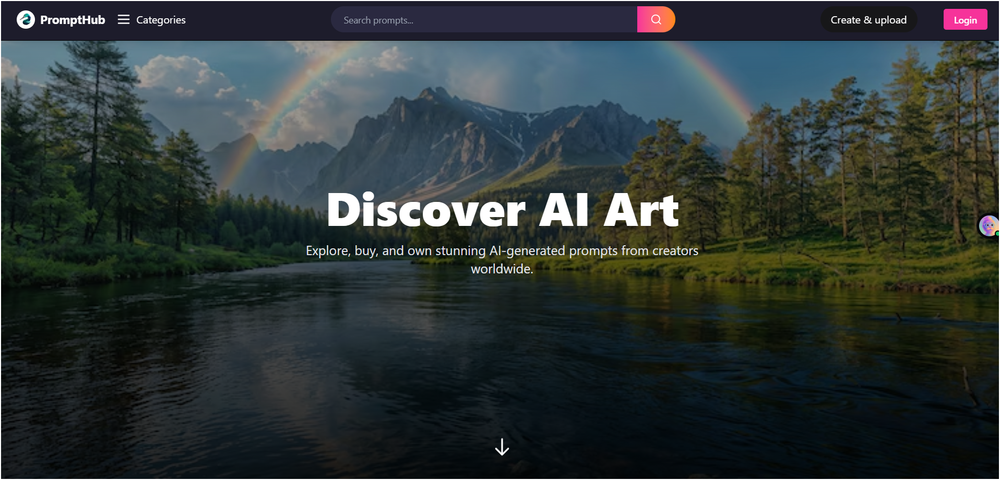
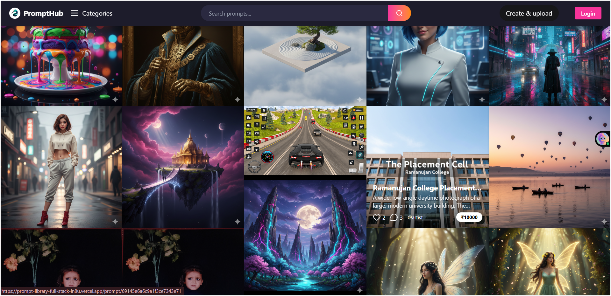
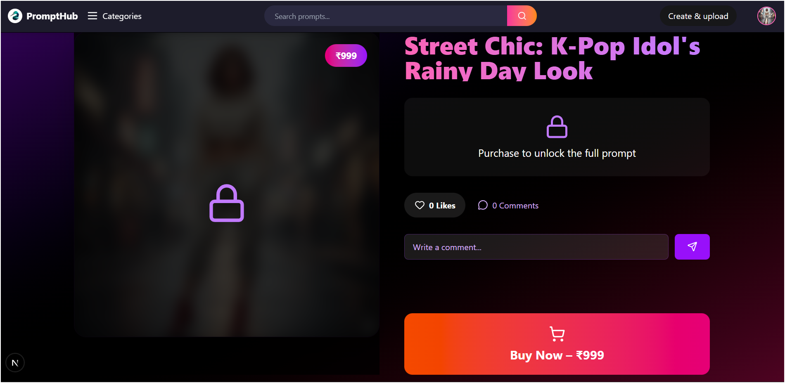
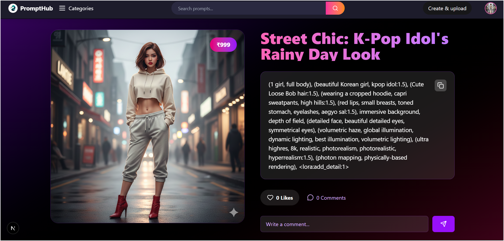
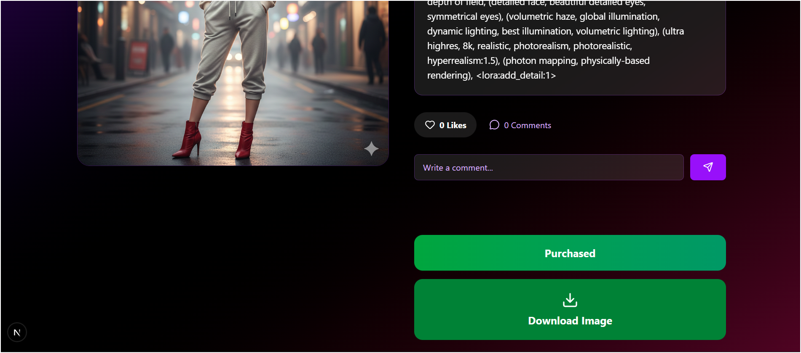

# Prompt Library – AI Prompt Marketplace & Community Platform


**A modern full-stack AI prompt marketplace where creators sell their prompts and users buy proven, high-quality AI prompts instantly.**

Live Demo → (Add your Vercel link here after deploy)

---

## 🚀 Features

- **User Authentication** – Login/Signup with Email + Google OAuth
- **Profile Dashboard** – View My Prompts, Purchased Prompts, Liked Prompts
- **Upload & Sell Prompts** – Set price, add preview image, tags, category
- **Razorpay Payment Gateway** – Buy premium prompts securely
- **Like & Comment System** – One like per user, real-time comments
- **Instant Download** – After purchase, download image immediately
- **Fully Responsive** – Works perfectly on mobile & desktop
- **SEO Optimized** – Built with Next.js 14 App Router

---

## 🛠 Tech Stack

| Category              | Technology                              |
|-----------------------|-----------------------------------------|
| Framework             | Next.js 15 (App Router + Server Components) |
| Language              | TypeScript                              |
| Styling               | Tailwind CSS                            |
| Authentication        | NextAuth.js                             |
| Database              | MongoDB + Mongoose                      |
| File Storage          | Amazon S3                               |
| Payment Gateway       | Razorpay                                |
| Deployment            | Vercel                                  |

---

## 🔥 Key Modules

1. **Authentication System**  
2. **User Profile & Dashboard**  
3. **Prompt Marketplace (Masonry Grid)**  
4. **Prompt Creation & Monetization**  
5. **Secure Payment Integration (Razorpay)**  
6. **Like & Comment System**  
7. **Purchase History & Download**  
8. **Responsive & SEO-Friendly UI**

---

## 📸 Screenshots


<div align="center">

### 🏠 Home Page – Beautiful Hero + Prompt Grid
Beautiful hero section with trending prompts in a responsive masonry grid  
Fully mobile-friendly • Dark gradient theme • Instant search ready




### 🔐 Login Page - Clean & Minimal
Clean, minimal login with Google OAuth & email/password  
Dark mode • Fast loading • Secure authentication


### 👤 Profile Dashboard – My Prompts, Purchased, Liked
Personalized view with My Prompts, Purchased & Liked tabs  
Avatar upload • Name edit • Stats panel


### 🎨 Prompt Detail Page – Full View + Buy Button
Full prompt view with title, description, tags, price & creator info  
Like, comment & real-time interaction • Buy button for paid prompts




### 💸 Razorpay Payment Gateway – Real Payment Flow 
Seamless & secure payment with real Indian Rupee support  
Test + Live mode • Instant confirmation


### ⬇️ Instant Download After Purchase
After successful payment → direct high-quality image download  
No waiting • No extra steps





</div>


---

## 🚀 Quick Start (Run Locally)

```bash
git clone https://github.com/yourusername/prompt-library.git
cd prompt-library
npm install
cp .env.example .env.local
# Add your keys in .env.local
npm run dev